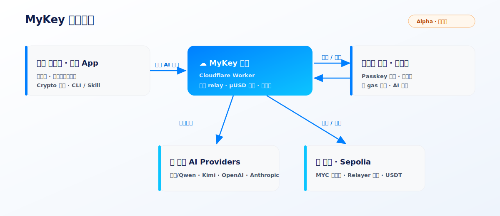
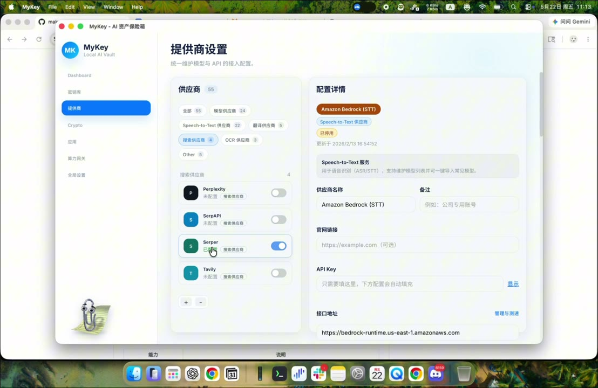

# MyKey · AI 资产保险箱 + 算力网关

<p align="center">
  
</p>

<p align="center">
  
  
  
  
  
  
</p>

> **一句话：MyKey 帮你保管三类 Token —— AI Token、API Token、Crypto Token；还能把自己用不完的额度分享给别人使用，顺便把成本赚回来。**

它由两部分组成：

1. **MyKey Desktop**（macOS 桌面应用，Tauri + React）— 本地优先的保险箱。AI Token、API Token、Crypto 钱包全部加密存在本地，绝不上云。
2. **MyKey Compute Gateway**（Cloudflare Worker）— 多租户算力网关。把你订阅里**用不完的上游 AI 额度**（百炼/Qwen、Kimi、OpenAI、Anthropic）分享出去：对方用 Passkey 建钱包、领额度红包、免 gas 兑换，然后直接对话或接入自己的客户端——**你回收成本，对方拿到便宜好用的算力。**

---

## 🏗 系统架构



> 运营者在桌面端共享自己授权的 AI 额度 → 网关计费/路由 → 朋友在浏览器领取、兑换、对话。

---

## 🎬 演示

[](https://github.com/makoshan/MyTokens/blob/main/docs/demo.mp4)

> ▶️ 点击上方封面播放演示（约 2 分半）；也可直接下载 [`docs/demo.mp4`](./docs/demo.mp4)。

---

## ✨ 功能一览

**🔐 保管三类 Token（桌面端，全部本地加密，绝不上云）**
- **AI Token / API Token** — 密钥库：Argon2 + AES-256-GCM，扫 `.env` 一键导入，按 Provider 分组管理。
- **Crypto Token** — 多链钱包：组合扫描（Alchemy / OKLink）、收款 QR、转账、Swap、NFT、活动记录。
- **解锁** — 主密码，或实验性原生 Passkey（Apple AuthenticationServices + WebAuthn PRF）。

**🤝 分享用不完的额度（算力网关）**
- **运营台** — 选 Provider（百炼/Qwen、Kimi、OpenAI、Anthropic），填上游 Token，自动建渠道/定价/路由。
- **邀请** — 一键生成带算力红包的邀请链接，随时可撤销、彻底断开某个朋友。
- **朋友端** — Passkey 钱包领红包 → 免 gas 兑换 → 「AI 对话」直接试用 → 需要时复制 API Key 接入自己的客户端。
- **计费** — OpenAI/Anthropic 兼容 relay，µUSD 余额 reserve/settle，Account Durable Object 并发安全，多租户隔离。

**🤖 AI 友好**
- headless `mykey` CLI（`--json` 输出）+ 内置 Claude Code skill，AI Agent 可直接驱动你的本地保险箱。

**🧰 其他**
- Clippy 助手（用量/稳定性分析）· Fn 全局语音输入 · 链上充值（MYC 红包 / gasless / USDT，跑 Sepolia 测试网）。

---

## ☁️ MyKey Compute Gateway（`cloud-gateway/`）

OpenAI / Anthropic 兼容的多租户 AI 网关，单部署服务多个运营者。

| 能力 | 说明 |
| --- | --- |
| **兼容 relay** | `/v1/responses`、`/v1/messages`、`/v1/models`，SSE 流式，adapter 驱动多 Provider |
| **计费** | per-account µUSD 余额，reserve / settle / refund，fail-closed 结算 |
| **Account Durable Object** | 单账户单实例，消除并发超花；DO alarm 自动退款 stale reservation |
| **多租户隔离** | 运营者用 EVM keypair（EIP-191 签名）注册/登录，数据按 `operator_id` 隔离 |
| **买家 Dashboard** | 红包领取 / 欢迎流程、Passkey 钱包、免 gas 兑换、AI 对话、API Key 自助管理 |
| **链上（Sepolia）** | MYC burn-to-credit 充值、红包、gasless redeem/transfer（relayer 代付）、USDT→MYC |
| **运维** | Admin 控制台、审计日志、IP allowlist（含 IPv6）、per-account 限流、GitHub Actions 部署 |

### 朋友上手主流程
1. 运营者在桌面「算力网关运营台」生成带红包的邀请链接。
2. 朋友打开链接 → 用 **Passkey** 创建钱包（无需助记词、由 PRF 确定性派生）。
3. 撒花领取算力红包（MYC），**免 gas** 兑换成 AI 额度。
4. 默认进入网页 **「AI 对话」**，无需创建 API Key 即可试用上游模型。
5. 需要接入自己的客户端时，再复制 Base URL 和 `sk-mykey_*`。

合约见 [`contracts/`](./contracts/)（`MyKeyComputeCredit.sol` + `MockStablecoin.sol`），运营手册见 [运营者 runbook](./docs/compute-gateway-operator-runbook.md)。

---

## 🤖 AI 友好 · CLI + Skill

MyKey 不止有图形界面——它能被 AI Agent / 脚本直接驱动，**不必打开桌面 App**。

### `mykey` 命令行
一个 headless Rust CLI，复用桌面 App 同一个加密 `vault.db`（同样的 AES-256-GCM、同样的 tcx-wasm keystore 引擎，CLI 建的钱包 GUI 能直接解锁签名）。

```bash
cd src-tauri && cargo build --features cli-tools --bin mykey   # 默认 App 构建不受影响

mykey vault status                 # 保险箱状态 / 解锁方式
mykey secret list [--reveal]       # 密钥库：API 凭据（默认打码）
mykey secret add --provider openai --name prod   # 省略 --key 时从 stdin / 隐藏提示读入
mykey wallet create --name main    # 随机助记词 → tcx keystore
mykey apikey providers             # 已配置的 AI Provider
mykey gateway creds claude_code    # 取算力网关接入凭据
mykey --json wallet list           # 任意命令加 --json 输出机器可读结果
```

- **主密码永不进 argv**：走 `MYKEY_MASTER_PASSWORD` 环境变量或隐藏提示。
- **`--json`**：所有命令支持机器可读输出，方便 Agent 解析。
- 覆盖：vault 生命周期、密钥库、Crypto 钱包（创建/导入/观察/导出）、Provider/数据源 API Key、网关凭据。

### Claude Code Skill
仓库内置 [`skills/mykey/SKILL.md`](./skills/mykey/SKILL.md)。把它复制到 `~/.claude/skills/mykey/`，Claude Code 就能在你说「密钥库」「创建钱包」「取网关凭据」时自动调用上面的 CLI——AI 直接、安全地操作你的本地保险箱。

---

## 📁 仓库结构

```
mykey/
├── src/                 # 桌面前端 (React + TS, Vite)
├── src-tauri/           # 桌面后端 (Rust / Tauri：vault、passkey、operator key)
├── cloud-gateway/       # Cloudflare Worker 网关 (relay / 计费 / DO / 多租户)
│   ├── src/             #   路由、provider adapter、billing、链上校验
│   ├── migrations/      #   D1 schema (0001–0006)
│   └── static/          #   admin 控制台 + 买家 SPA 构建产物
├── buyer-dashboard/     # 朋友端买家 Dashboard (Vite SPA)
├── contracts/           # Solidity 合约 (MYC 额度代币 + 测试 USDT) + Foundry 测试
├── cloudflare/          # passkey AASA worker
├── scripts/             # tcx-keygen 等工具
├── skills/              # Claude Code skill (mykey — AI 驱动 CLI)
└── docs/                # 设计、计划、运营手册、配图
```

---

## 🚀 构建与运行

### 桌面应用

**前置**：macOS 10.13+ · Rust 1.77+ · Node.js 18+

```bash
git clone https://github.com/makoshan/MyTokens.git mykey
cd mykey
npm install

npm run tauri:dev              # 开发模式
npm run tauri:build            # 构建 .app
npm run tauri:build:dmg        # 构建 Universal DMG
```

快速检查：

```bash
npm run test:linkage
npm run test:gateway
```

### 网关（Cloudflare Worker）

```bash
cd cloud-gateway
npm install
npm test                       # node:test 套件
npm run test:workers           # workerd (vitest-pool-workers) DO 测试
npm run dev                    # 本地 wrangler dev
```

部署需配置 `wrangler secret`（`ADMIN_TOKEN`、`MASTER_KEY_V1`、`SERVER_PEPPER`、`RELAYER_PRIVATE_KEY` 等），细节见 [`cloud-gateway/DEPLOY.md`](./cloud-gateway/DEPLOY.md)。**密钥永不入库**——`wrangler.toml` 只放公开的链上地址等非敏感变量。

---

## 🔧 常见问题

**Q：我的密钥会被上传吗？**
A：桌面端不会，所有密钥加密存本地。网关端为了替朋友代调模型，会解密你上传的**上游 Token**——其他运营者看不到，但平台方技术上能解密（见文末「Alpha 状态与边界」）。

**Q：MYC 能赚钱吗？**
A：不能，也不应这样理解。MYC 是 alpha 阶段的算力额度凭证，跑在测试网，没有真实价值。

**Q：可以公开拉人用吗？**
A：不建议。Provider 授权和法律意见都未到位，公开转售有真实风险。当前只面向受信朋友。

---

## ⚠️ Alpha 状态与边界

这是一个**面向受信朋友的 alpha 项目**，不是公开服务。在公开推广前请正视以下边界：

- **测试网**：链上部分跑在 **Sepolia 测试网**，MYC / USDT 都是测试币，**没有真实价值**。
- **MYC 是算力额度凭证，不是投资品**：1 MYC ≈ $1 的服务额度，烧币得额度（burn-to-credit），不承诺升值、不做收益承诺。
- **Provider 授权（Gate 1）未取得**：转售百炼/Kimi/OpenAI/Anthropic 的订阅算力可能违反对应 Provider 的 ToS，账号被封会导致所有朋友断供。
- **加密边界**：网关需要解密运营者的上游 Token 才能代调模型——其他运营者看不到你的 Token，但**持有 `MASTER_KEY_V1` 的平台方技术上能解密**，做不到对平台的端到端加密。

简言之：**只把它发给信任的人，在小圈子里跑。**

---

## 🤝 致谢与许可证

灵感来源：
- [ClaudeBar](https://github.com/tddworks/ClaudeBar)
- [cc-switch](https://github.com/farion1231/cc-switch)
- [consenlabs/token-ui](https://github.com/consenlabs/token-ui)（钱包视觉语言）

MIT License.
