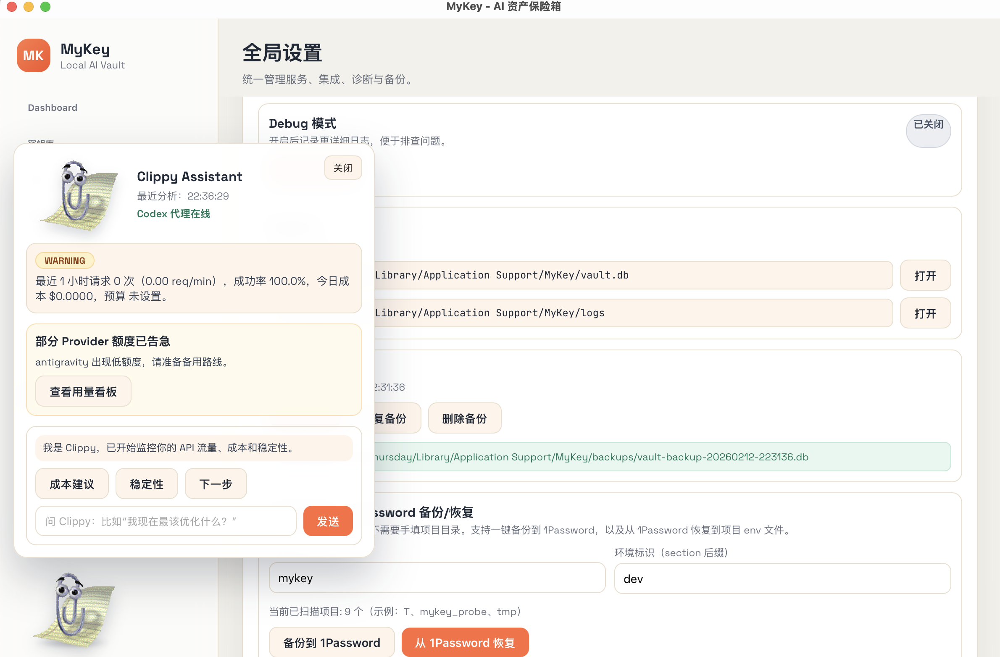
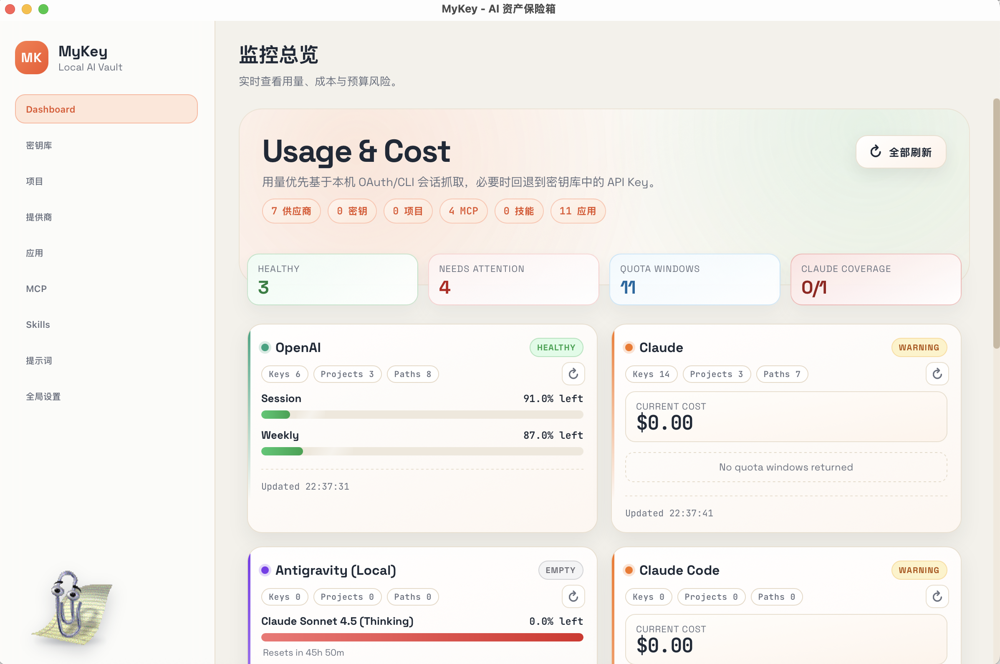

# MyKey - AI Asset Vault & Intelligent Gateway

<p align="center">
  
</p>

<p align="center">
  <a href="https://github.com/makoshan/Mykey/releases"></a>
  
  
</p>

**MyKey** 是一个本地优先的桌面应用，专为开发者设计。它不仅是你的 API 密钥保险箱，更是 AI Agent 时代的智能网关。

它集成了 **Clippy AI 助手**，帮助你实时监控 API 成本、分析稳定性，并智能路由请求。所有数据加密存储在本地，安全无忧。

---

## ✨ 核心特性

### 📎 Clippy Assistant (New!)
内置智能助手，实时分析你的 API 使用情况。
- **成本预警**: 当每日预算接近上限时自动提醒。
- **稳定性监控**: 实时检测 API 错误率和延迟，建议切换线路。
- **智能对话**: 直接问它 "我现在最该优化什么？"，获取可执行建议。

### 📊 Usage Dashboard
全新设计的可视化看板，让每一分钱都花得明明白白。
- **实时流量**: 监控 RPS、成功率、平均延迟。
- **成本追踪**: 按 Provider、模型、时间维度统计消耗。
- **额度监控**: 直观展示各个 Key 的剩余额度。

### 🔐 本地资产保险箱
- **零信任架构**: 数据仅存储在本地 SQLite，绝不上云。
- **军工级加密**: 敏感字段使用 **Argon2** 派生密钥 + **AES-256-GCM** 加密。
- **自动导入**: 智能扫描项目目录下的 `.env` 文件，一键导入。

### 🔌 多 Provider 支持
无缝支持主流 AI 服务商：
- OpenAI (GPT-4o, o1)
- Anthropic (Claude 3.5 Sonnet)
- Google Gemini (Pro 1.5)
- DeepSeek (V3)
- 更多即将推出...

---

## 📸 界面预览

### 仪表盘与 Clippy

*实时监控 API 流量与成本，Clippy 随时待命。*

### 密钥管理

*统一管理所有 API 密钥，支持快速搜索和分组。*

---

## 🚀 下载与安装

### 方式 1: 预编译安装包 (推荐)

目前支持 macOS (Intel & Apple Silicon)。Windows 和 Linux 版本正在开发中。

[](https://github.com/makoshan/Mykey/releases/latest)

1. 点击上方按钮前往 Releases 页面。
2. 下载最新的 `.dmg` 文件。
3. 双击安装并拖入应用程序文件夹。

### 方式 2: 从源码构建

如果你更喜欢折腾，可以自己编译。我们提供了便捷的构建脚本。

**前置要求**:
- macOS 10.13+
- Rust 1.77+
- Node.js 18+

```bash
# 1. 克隆仓库
git clone https://github.com/makoshan/Mykey.git
cd Mykey

# 2. 快速构建 DMG (推荐)
# 此脚本会自动检查环境、安装依赖并生成通用二进制 DMG
./build-dmg.sh

# 构建产物位于: src-tauri/target/release/bundle/dmg/
```

或者手动分步构建：

```bash
# 安装依赖
npm install

# 运行开发模式
npm run tauri:dev

# 构建应用 (.app)
npm run tauri:build

# 构建 DMG (Universal)
npm run tauri:build -- --target universal-apple-darwin
```

---

## 🔧 常见问题

**Q: 我的 Key 会被上传吗？**
A: **绝对不会**。MyKey 是本地优先应用，所有网络请求仅发生在你的设备与 AI 服务商之间。

**Q: Clippy 助手是如何工作的？**
A: Clippy 运行在本地，基于你本地的网关日志进行规则分析。如果启用 Codex 模式（可选），它会通过你配置的 API Key 调用大模型来生成更智能的建议。

---

## 🤝 贡献

欢迎提交 Issue 和 Pull Request！

感谢以下项目提供的灵感：
- [ClaudeBar](https://github.com/tddworks/ClaudeBar)
- [cc-switch](https://github.com/farion1231/cc-switch)

## 📝 许可证

MIT License.
