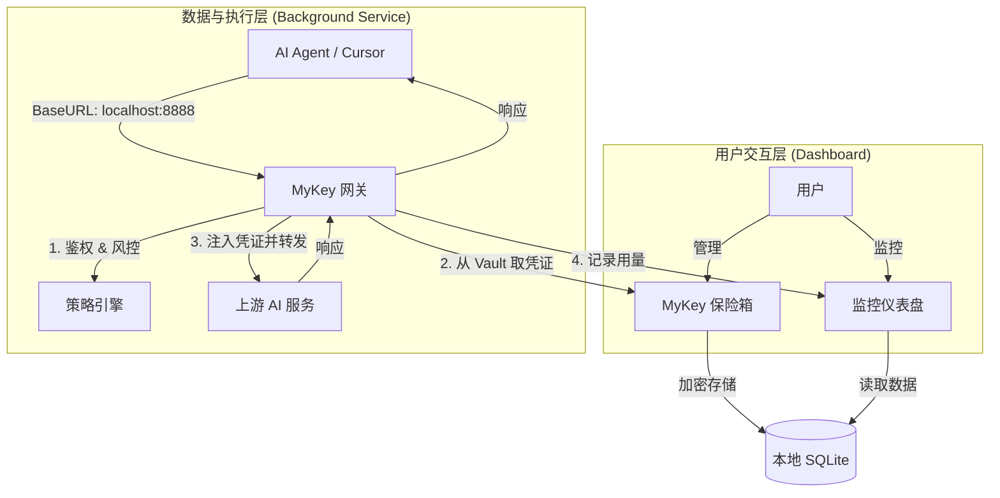

# MyKey: 本地化 AI 资产与权限控制平面 V3

**版本**: 3.0 (MVP)
**状态**: 产品需求已定义
**负责人**: Mako

> **一句话定义**: MyKey 是一个本地优先的 **AI 资产保险箱**与**统一订阅网关**，它将您散落各处的 API 密钥和付费订阅（如 Claude, Kimi）集中管理，并为所有 AI 工具和应用提供一个可监控、可审计、可分发的安全入口。
> 
MyKey 不应做 PAI 做的事（记忆系统、技能路由），而应做 PAI 不会做的事（成本归因、安全审计）
MyKey 是一个在本地运行的 HTTP 代理，AI 工具使用虚拟 Key 向其发起请求，代理在服务端查找并注入真实 Key
后转发给上游 AI 服务商，返回响应的同时记录用量和成本。

通信协议：MyKey 暴露 REST API，PAI Pack 用 fetch/axios 调用
配置同步：PAI Pack 安装时自动设置 OPENAI_BASE_URL=http://localhost:8888

---

## 1. 背景与问题陈述 (The Why)

随着生成式 AI 与大语言模型的普及，开发者和高级用户正以前所未有的深度和广度将 AI 能力集成到日常工作流中。从代码补全、草稿撰写到自动化任务，AI 工具（如 Cursor, OpenClaw）和底层模型（如 OpenAI, Anthropic）已成为新的生产力引擎。然而，这种爆炸式增长也带来了一个日益严峻的“凭证管理悖论”：

> 我们渴望赋予 AI 工具强大的能力，但又对其缺乏足够的信任和控制。
> 

这种矛盾导致了一系列具体的、高频的痛点，严重影响了开发效率、成本控制和安全性。

### 1.1 核心痛点 (Pain Points)

| 痛点类别 | 具体表现 |
| --- | --- |
| **管理碎片化** | API 密钥散落在不同的 `.env` 文件、`~/.bashrc`、CI/CD 平台（如 GitHub Actions）的 Secrets 中，难以进行统一的盘点、轮换或撤销。 |
| **配置疲劳** | 每当尝试一个新的 AI Agent 或 CLI 工具时，都需要重复查找、复制和粘贴 API 密钥，并且需要适应不同工具的特定配置格式。 |
| **切换困难** | 在个人项目与工作项目、或者在不同云服务提供商（如 OpenAI vs Azure OpenAI）之间切换时，操作繁琐且容易出错。 |
| **监控黑盒** | 无法实时、直观地监控哪个应用或 Agent 正在使用哪个 Key、消耗了多少 Token、花费了多少成本。问题往往在收到高额账单后才被发现。 |
| **安全盲区** | 凭证的泄露路径不可预测。一旦泄露，损失可能是巨大的。现有的管理方式多为“事后补救”（轮换密钥），缺乏“事前预防”和“事中干预”的机制。 |
| **迁移不便** | 更换开发机器或重建开发环境时，需要手动迁移所有散落的密钥，过程痛苦且容易遗漏。 |

#### 1.1.1 API KEY 管理提示 (User Pain Points)

- **只显示一次**: 密钥通常只会在新建后显示一次，必须自行妥善保存，否则需要重新生成。
- **禁止共享**: 不要与他人共享 API KEY，也不要将其暴露在客户端代码中。
- **数量上限**: 通常最多保留 10 个 API KEY，同一网站的 Key 过多会导致管理负担与风险上升。
每个项目都需要配置 .env 文件，github 泄露的风险，zshrc 也可以配置，管理混乱，AI 也不知道去哪里拿

社区的痛点：
引导是AI推断密钥关联的第三方网站申请密钥流程
希望支持直接同步到 Vercel 或者 AWS Parameter Store 吗？目前密钥跨平台管理太心累了

#### 1.1.2 操作系统密钥环的启发 (Keyring Insight)

Linux 的密钥环（Keyring）/Secret Service 是一个系统级安全子系统，用于集中存储敏感信息并与用户登录态绑定。它给 MyKey 的启发是：

- **不用再造轮子**：真正的“密钥加密材料”优先交给系统密钥环（如 GNOME Keyring、KWallet、macOS Keychain、Windows Credential Manager），MyKey 只保存元数据与加密后的密钥。
- **自动解锁体验**：系统密钥环通常随用户登录自动解锁，能显著减少“重复输入主密码”的摩擦。
- **安全边界清晰**：通过 Secrets API/Keyring API 读取密钥，避免在磁盘上长时间存放明文。
- **跨平台策略**：桌面环境可直接走 Keyring，纯 CLI/无桌面环境则回退到本地加密 SQLite（仍由主密码派生密钥）。

这意味着 MyKey 的存储策略可以分层：
1) **密钥材料**：优先放入系统密钥环；  
2) **业务数据**（配置、模型、用量）：继续落在本地 SQLite；  
3) **兼容性**：在 Keyring 不可用时启用纯本地加密模式。

### 1.2 目标用户 (Target Audience)

MyKey 的 MVP 阶段将精准服务于以下核心用户群体：

- **个人开发者**: 拥有多个 LLM Provider 的 API 密钥，经常在不同项目/Key 之间切换，方便查看和切换 Key, 监控用量
- **AI Agent 重度用户**: 在本地环境高频、高并发地运行 OpenClaw、各类 CLI 工具或 IDE 插件，需要一个稳定、可靠的流量入口和监控中心。

**非目标用户 (MVP 阶段不优先考虑)**: 需要企业级 IAM 集成、多租户组织管理、或云端托管密钥的大型企业团队。

---

## 2. 解决方案与产品架构 (The How)

MyKey 通过提供一个**统一的本地控制平面**来解决上述所有问题。它将密钥管理与使用彻底分离，遵循“信任，但要验证和控制”的原则。

### 2.1 三大核心组件

1. **保险箱 (Vault)**: 一个本地的、经过强加密的数据库（SQLite），用于安全地存储您的所有 AI 资产（API Key, Session Token 等）以及相关的配置信息。
2. **网关 (Gateway)**: 一个在后台运行的本地 HTTP(S) 代理，它会拦截所有发往 AI 服务商的请求，执行策略，并安全地注入凭证。
3. **仪表盘 (Dashboard)**: 一个简洁直观的图形用户界面，用于管理资产、配置策略、实时监控用量与成本，并执行熔断等风控操作。

#### 2.1.1 Secret Store 的渐进增强与容错

| 设计目标 | MVP 策略 |
| --- | --- |
| 渐进增强 | MVP 只用 SQLite，后续可接入 Keychain / 1Password 等系统级密钥后端 |
| 容错设计 | 多 Provider 链式查找，本地没有再查云端，避免单点不可用 |

这个模式让 MyKey 现在专注于 SQLite 实现，未来扩展其他后端时完全解耦。

### 2.2 系统架构

MyKey 采用 **Vault (存储)** 与 **Gateway (执行)** 分离的架构，确保了安全与性能的平衡。

### 2.3 核心工作流程

1. **录入 (Onboarding)**: 用户在 MyKey Dashboard 中添加一个或多个 AI 服务提供商的凭证（API Key 或 Web Session）。
2. **生成令牌 (Token Generation)**: MyKey 为用户生成一个本地的、用于身份认证的 `sk-mykey-xxxx` 会话令牌 (Session Token)。
3. **接入工具 (Integration)**: 用户在 Cursor/CLI/LangChain 等工具中，将 API 的 `Base URL` 指向 MyKey 网关地址（如 `http://127.0.0.1:8888/v1`），并将 `API Key` 字段填写为上一步生成的会话令牌。
4. **调用与拦截 (Proxy & Control)**:
a. 客户端工具的 API 请求被 MyKey 网关拦截。
b. 网关校验会话令牌，执行预算、限流等风控策略。
c. 从保险箱中解密并取出真实的凭证，注入到请求中并转发给上游服务商。
d. 接收响应，记录用量和成本，并将响应返回给客户端。
5. **风控 (Risk Management)**: 如果请求超出预算，网关将直接拒绝。用户可以随时在仪表盘上手动暂停某个凭证，或激活“全局熔断”开关以应对紧急情况。

---

## 3. MVP 功能范围 (The What)

MyKey 的 MVP 将聚焦于核心价值的闭环，以“务实”和“兼容”为首要原则，为用户提供一个“开箱即用”的强大工具。

### 3.1 资产保险箱 (Asset Vault)

采用**分层支持 (Provider Tiering)** 策略，确保核心体验的稳定可靠。

| 层级 | 类型 | 包含范围 | MVP 支持程度 |
| --- | --- | --- | --- |
| **Tier 1 (核心)** | **API Keys** | OpenAI & 所有 OpenAI-compatible 服务 (DeepSeek, OpenRouter, 本地 vLLM 等) | **完全支持**。Token 计量与成本估算最准确。 |
| **Tier 2 (适配)** | **API Keys** | Anthropic, Gemini | **尽力支持**。通过协议适配层接入，核心功能可用，但部分高级特性（如成本估算）可能存在偏差。 |
| **Tier 3 (实验性)** | **Web Sessions** | Cursor, Kimi | **实验性支持**。用户可导入 Session Token/Cookie，MyKey 会尝试将其转化为 API 形式。不保证长期可用性。 |
- **本地强加密**: 所有凭证使用 **AES-256-GCM** 算法加密，密钥由用户主密码通过 **Argon2** 派生。
- **批量导入 (Smart Import)**:
    - **深度扫描**: 递归扫描项目目录 (忽略 `node_modules`, `.git`)，自动发现 `.env` 文件。
    - **智能识别**: 基于 Regex 模式 (如 `sk-proj-`, `AIzaSy`) 自动推断 Provder (ShipKey 逻辑)。
    - **安全解析**: 本地解析 `.env` 键值对，仅提取潜在 Key，不上传任何文件内容。
- **安全查看**: 凭证在 UI 中默认隐藏，查看或复制需要二次验证（输入主密码），可以前往付费的入口。
- **订阅统一化**: 将不同来源的订阅（如 Cursor Pro, Kimi 会员）转化为统一的 API 接口供本地 APP 使用。

### 3.2 智能网关 (Smart Gateway)

- **统一入口**: 默认暴露 `localhost:8888`，对外呈现为标准的 OpenAI 接口。
- **务实的协议兼容**:
    - **核心支持**: 完美兼容 `chat/completions` 端点，包括流式响应 (SSE)，覆盖 95% 以上的主流工具（Cursor, OpenClaw, LangChain 等）使用场景。
    - **按需补齐**: 其他端点 (Embeddings, Images, Audio) 视社区需求热度，逐步支持，不追求大而全的完美兼容。
- **透明注入**: 调用方无需感知底层是 API Key 还是 Web Session，统一使用 MyKey 的会话令牌进行交互。

### 3.3 风控与审计 (Control & Audit)

- **每日预算**: 可为每个凭证或全局设置每日消费上限（USD），超额自动拒绝请求。
- **全局熔断**: 在仪表盘提供一个醒目的“紧急停止”按钮，一键暂停所有通过网关的服务。
- **实时仪表盘**: 可视化展示今日/本周的累计 Token 消耗与预估费用，并以图表形式展示费用趋势。
- **请求流水**: 以列表形式清晰记录每一笔通过网关的请求，包括时间、来源、模型、Token 数、费用和状态。

---

## 4. 路线图 (The When)

- **v1.0 (MVP)**: 聚焦个人开发者，核心目标是**统一管理与监控**。实现一个 App 查看所有的 Key 和快速修改 Key 配置，用量计费，优先发布 macOS 版本，快速验证核心价值。

1. 批量导入 (Smart Import)**:
    - **深度扫描**: 递归扫描项目目录 (忽略 `node_modules`, `.git`)，自动发现 `.env` 文件。
    - **智能识别**: 基于 Regex 模式 (如 `sk-proj-`, `AIzaSy`) 自动推断 Provder (ShipKey 逻辑)。
    - **安全解析**: 本地解析 `.env` 键值对，仅提取潜在 Key，不上传任何文件内容。

2. 一个管理不同的大语言模型 Key API
3. 管理工具的 Key，比如搜索、翻译
4. 一个页面管理提示词
5. 一个页面管理 MCP
6. 一个页面管理 Skills

---

## 5. 参考项目与技术标准 (References & Standards)

### 5.1 架构参考 (Inspiration & Essence)

- [**CC-Switch**](https://github.com/farion1231/cc-switch): 代理架构与故障转移参考。
    - **Forwarder Logic**: 实现了精细的 Header 过滤（黑名单机制，如 `content-length`, `accept-encoding`），并特殊处理 `x-forwarded-for` 以透传真实 IP。
    - **Failover Switch**: 实现了基于“去重锁” (`pending_switches`) 的故障转移机制，确保高并发下切换的原子性，并联动更新托盘菜单和前端状态。
- [**Claude Relay Service**](https://github.com/farion1231/claude-relay-service): 协议转换与适配参考。
    - **Bridge Service**: 实现了 Anthropic <-> Gemini 的双向协议桥接。
    - **Schema Compression**: 为了适配不同 Provider 的 Context Window 限制，实现了智能的 JSON Schema 描述压缩算法（截断非必要字段，保留关键约束）。
    - **Thinking Block Rectifier**: 针对 Think 模型的特殊整流器，能够清理无效的签名 (`thinking.cache_control`) 并自动补全缺失的 `tool_result` 以避免并发错误。
- [**ShipKey**](https://github.com/chekusu/shipkey): 密钥扫描参考。
    - **Smart Scan**: 递归扫描 + 正则推断 (Regex Inference) 实现零配置密钥发现。

### 5.2 技术栈 (Tech Stack)

- **Desktop**: [Tauri](https://tauri.app/) (Rust + React) - 轻量级、高安全性的跨平台桌面框架。
- **Proxy Core**: [Axum](https://github.com/tokio-rs/axum) - 基于 Tokio 的高性能 Rust Web 框架，处理高并发 API 流量。
- **Database**: [SQLite](https://www.sqlite.org/) - 本地嵌入式数据库，配合 SQLCipher 实现落盘加密。
- **Crypto**: [Argon2](https://github.com/RustCrypto/password-hashes) - 行业标准的密码哈希算法，用于主密码派生与密钥加密。

### 5.3 安全标准 (Security Standards)

- [**OWASP**](https://owasp.org/): 遵循桌面应用安全与 API 安全最佳实践 (ASVS)。
- [**NIST**](https://csrc.nist.gov/): 遵循 NIST SP 800-63 数字身份认证指导方针（关于密码存储与加密周期的建议）。
- [**OAuth 2.0**](https://tools.ietf.org/html/rfc6749): 在 Phase 2 身份认证中，借用 Bearer Token 机制设计 Session Token。

---

## 6. 可借鉴的安全设计要点（来自云端密钥托管服务文章）

虽然 MyKey 是本地优先，但云端托管服务的安全设计仍有可借鉴之处：

1. **加密算法可选项**  
AES-256-GCM 仍是默认；可保留 ChaCha20-Poly1305 作为可选实现（软件实现快、恒定时间、AEAD 内置认证）。  

2. **用后即焚的内存安全**  
引入 `zeroize`（或 ZeroizeOnDrop）在请求结束后显式清理明文密钥，降低内存残留风险。  

3. **分级管控（Access Level）**  
用虚拟 Key 的等级系统统一限制可访问模型、预算、速率等策略。  

4. **多 Key 负载均衡与故障转移**  
对同一 Provider 建立 Key 池，轮询选择健康 Key，连续失败自动隔离。  

5. **MyKey 不需要的复杂性**  
本地应用不必引入零知识证明、密钥分片、多层嵌套加密等云端取信机制。  

6. **MyKey 应该做的**  
落盘加密（SQLite + SQLCipher）、内存安全（Zeroize）、进程隔离（Gateway 独立进程）。

---

## 7. 实施对齐状态（代码实况，2026-02-12）

> 本节用于同步“产品目标”与“当前代码实现”，避免把目标态误认为已交付能力。

### 7.1 已实现（与文档目标一致或部分一致）

- **本地网关入口已落地**：存在本地网关服务与可配置端口，默认 `127.0.0.1:8888`。
- **虚拟 Key 链路已落地**：已支持 `sk-mykey-*` 令牌生成与按应用路由解析。
- **Claude/Codex 基础代理已可用**：
  - Claude: `POST /v1/messages`
  - Codex: `POST /v1/responses`、`POST /v1/responses/compact`
  - OpenAI 兼容别名：`POST /v1/chat/completions`（当前复用 Codex responses relay）
- **应用接入配置已打通**：`claude-code` 与 `codex` 可在应用配置页拿到 gateway base url + key，并写回本地配置。
- **Dashboard 与全局管理已增强**：MCP/Skills 全局页、应用页模型/MCP/Skills 管理、Overview 快捷跳转入口已具备。
- **主密码安全升级已完成**：主密码哈希从历史 MD5 升级为 Argon2，并包含旧哈希自动迁移逻辑。

### 7.2 部分实现（有骨架，但未达文档验收口径）

- **风控与监控**：已有 Usage/Cost 抓取与展示，但“按网关请求粒度”的预算阻断与请求流水未闭环。
- **协议兼容**：已覆盖核心入口，但 `chat/completions` 仍为 Codex relay 兼容路径，尚未形成完整 OpenAI Chat 语义桥接。
- **错误/重试策略**：已有基础错误返回与部分头透传，尚未完全对齐 `claude-relay-service` 的完整重试、429/401/5xx 处置与分类降级策略。

### 7.3 尚未实现（文档内明确目标，当前代码缺失）

- **请求流水账本**：缺少“每笔请求（时间/来源/模型/token/费用/状态）”的统一落库与查询 API。
- **预算与熔断闭环**：缺少“每日预算硬阻断 + 全局熔断开关影响网关放行”的策略执行链。
- **内存敏感数据清理**：尚未系统性接入 `zeroize` 与关键路径清理策略。
- **SQLCipher 落盘加密**：当前为 SQLite，本地数据库加密能力未按文档目标完成。

### 7.4 参考项目对齐说明（避免引用混淆）

- **`claude-code-tool-manager`**：用于 MCP/Skills 管理页面与库数据来源对齐。
- **`claude-relay-service`**：用于网关代理行为、头过滤、SSE 转发、错误映射与限流恢复策略对齐。

当前判断：并未“功能全部实现”。
当前状态是：**MVP 主链路已跑通，风控/审计与网关深度策略仍在实现中**。
